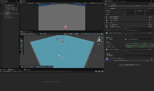

# 📦 Modular Clean Game Architectures and Systems (Unity 6 + MVP + FSM)

A production-ready, scalable Inventory System demonstrating **Clean Architecture**, **Dependency Injection**, and **Test-Driven Development (TDD)** in Unity.

## 🎯 The Goal
To engineer a system that solves the common "Spaghetti Code" problems in game development. This project moves away from tight coupling (Singletons/Monobehaviours) to a modular architecture where **Logic**, **Data**, and **UI** are completely separated.

## ✨ Key Features
*   **📐 Model-View-Presenter (MVP):** Decouples business logic from the Unity UI. The Model is pure C# and has no dependencies on `UnityEngine.UI`.
*   **💉 Dependency Injection (VContainer):** Implements a stateless architecture. Services and Models are injected, making the system modular and easy to expand (e.g., sharing the Save System with Chests or Shops).
*   **💾 Persistence Layer:** A robust, stateless JSON Save/Load service handling Data Transfer Objects (DTOs) and `ScriptableObject` registry lookups.
*   **🖱️ Complex Interaction:** Full Drag-and-Drop system utilizing Unity's `IBeginDragHandler` and `IDropHandler` interfaces, connected by the Presenter.
*   **🧪 Unit Testing:** 

Core logic (Stacking, Swapping, Capacity limits) verified with NUnit EditMode tests.
*   **🤖 Modular Character Controller:** A Finite State Machine (FSM) implementation where behaviors (Idle, Move, Jump) are isolated in pure C# classes.
*   **🏗️ State Pattern:** States are decoupled via C# Events (`OnMove`, `OnJump`, etc...), allowing the Controller to act as a logic switchboard without spaghetti code.
*   **⚙️ Data-Driven Tuning:** Movement physics (Speed, Jump Force) are configured via `ScriptableObjects`, enabling designers to tweak feel without code changes.
*   **🎮 Input Bridging:** An `InputReader` layer that converts inputs into Domain-specific data structs, keeping logic independent of the Input System.
*   **🧠 Utility AI Brain:** A non-linear decision-making system where NPCs evaluate actions based on scored considerations (0.0 - 1.0).
*   **📉 Normalized Response Curves:** Uses Unity `AnimationCurves` to translate raw game data (Hunger, Distance) into utility scores, allowing for organic, emergent behavior.
*   **🤝 System Integration:** The AI acts as a "Puppeteer," controlling the FSM Character Body and consuming items his Inventory System.

## 🎮 Gameplay Demos

### 1. Finite State Machine (Movement & Physics)
Character Moving, Jumping, and Air Control.

### 2. Inventory System (MVP)
Drag & Drop, Stacking, and JSON Save/Load.

### 3. Utility AI
The Purple NPC decides between Chasing and Eating dynamically, then idle once reaches the target (player).

## 🏗️ Architecture Overview

### 1. The Domain (Model) 🧠
*   **Responsibility:** Holds the state (e.g., `InventorySlot`, `PlayerStateMachine`) and executes logic.
*   **Key Trait:** Reactive. Fires C# Events when state changes.
*   **Tech:** Pure C#. No Monobehaviours.

### 2. The View (UI & Input) 🖼️
*   **Responsibility:** Renders the grid, captures Input (Clicks, Drags), and handles Physics/Animation.
*   **Key Trait:** Passive. It does not decide *what* happens, only *that* an interaction occurred.
*   **Tech:** Unity UI, Event Interfaces, Input System.

### 3. The Presenter (Controller) 🔌
*   **Responsibility:** The "Glue." Listens to the View events and calls Model commands/methods.
*   **Key Trait:** Testable. It can be unit tested by mocking the View and Model.
*   **Tech:** VContainer EntryPoint (`IStartable`, `IDisposable`).

### 4. The Character Wiring 🏃
*   **The Brain (StateMachine):** A pure C# class that manages transitions (`Enter`, `Exit`, `Update`, `FixedUpdate`).
*   **The States:**
    *   **Idle:** Listens for input to transition to move or jump.
    *   **Move:** Handles ground movement, rotation, and transitions.
    *   **Jump:** Handles physics impulses and air-control.
*   **Decoupling:** States communicate via **Events**. The `IdleState` doesn't know the `MoveState` exists; it just fires `OnMove`, and the `PlayerController` handles the transition.

### 5. The Utility AI (The Brain) 🤖
*   **The Reasoner:** A generic processor that loops through available actions and picks the highest score.
*   **The Math:** Uses `UtilityActionBase` to multiply scores. If *any* consideration is 0 (e.g., No Food), the entire action becomes impossible (Score 0).
*   **The Bridge:** `CurveConsideration` acts as a universal adapter, converting any data type (`Func<float>`) into a normalized utility score.
*   **Emergent Behavior:** We don't program "If Hungry -> Eat." We program "Hunger increases desire to eat." The AI balances this against its desire to Chase.

## ⚔️ "Legacy" vs "Modern" Comparison

This project includes a [Legacy Reference Script](Assets/Documentation/Legacy_Reference/LegacyInventoryManager.cs) to demonstrate the improvement over the standard implementation.

| Feature | Legacy Approach (Junior) | Modern Approach (This Project) |
| :--- | :--- | :--- |
| **Data Access** | `InventoryManager.Instance` (Singleton) | `[Inject]` via VContainer |
| **Save System** | `PlayerPrefs` inside UI code | `JsonInventoryService` (Stateless) |
| **Coupling** | Logic references UI Text/Images | Logic fires Events, UI listens |
| **Testing** | Impossible without playing Scene | Logic tested in < 0.1s via Test Runner |

## 🚀 How to Run
1.  Open the project in **Unity 6**.
2.  Open **Test Runner** (Window > General > Test Runner) and run EditMode tests to verify logic.
3.  Open `Prototype_Scene`.
4.  **Controls:**
    *   **WASD / Arrows**: Move Character
    *   **Space**: Jump (with Air Control)
    *   **A**: Add Sword
    *   **S**: Add 5 Potions (Stacking Test)
    *   **R**: Remove Item
    *   **K**: Save Inventory to JSON
    *   **Mouse**: Drag and drop items to swap slots.

## 📂 Project Structure
*   `_Project/Scripts/Core`: Shared Interfaces and Signals.
*   `_Project/Scripts/Features/`:
    *   `Inventory/`: The Core MVP Module.
        *   `/Domain`: Logic & Data (Model, ScriptableObjects).
        *   `/View`: UI Scripts (MonoBehaviours).
        *   `/Presentation`: Presenters (Pure C#).
        *   `/Services`: JSON Persistence.
    *   `Character/`: The FSM Module.
        *   `/Domain`: StateMachine, States (Idle, Move, Jump).
        *   `/View`: InputReader, Physics.
        *   `/Data`: Player Settings SO.
    *   `AI/`: The Utility Module.
        *   `/Domain`: Reasoner, Considerations (Math).
        *   `/Actions`: Concrete behaviors (Chase, Eat, Idle).
        *   `/Components`: The NPC Agent & Stats.
*   `_Project/Tests`: NUnit Test Assembly.
